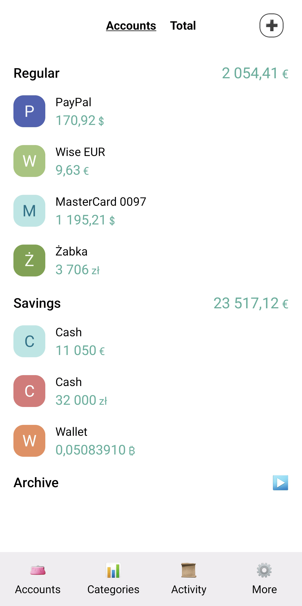
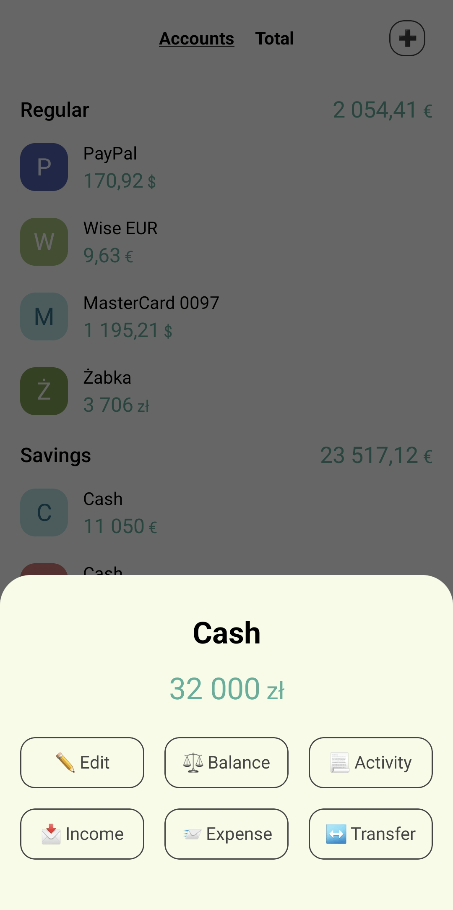
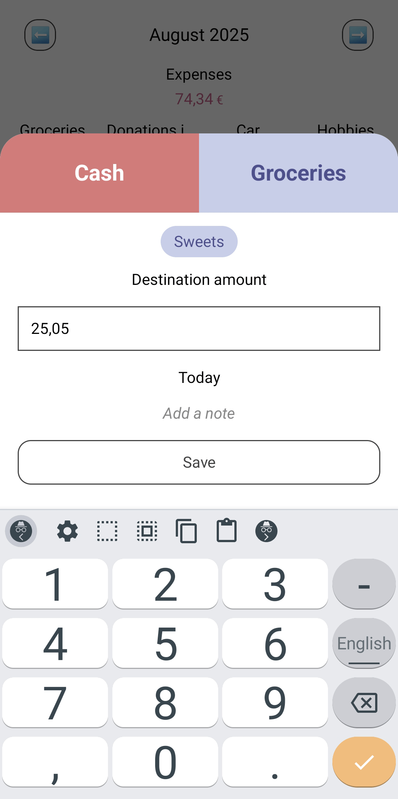
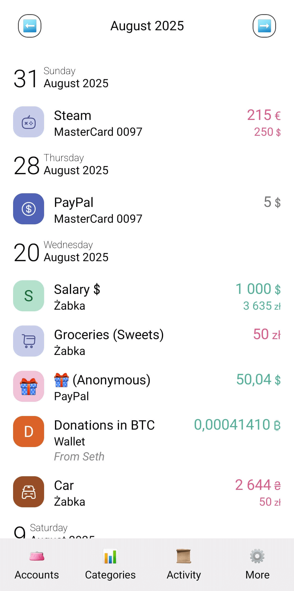

# 4Money

I'm building an expense tracking app inspired by [1Money](https://play.google.com/store/apps/details?id=org.pixelrush.moneyiq), which was very nice but got screwed up. 

The bar for such applications is quite high. My current goal is not to build a general purpose expense tracker for wide audience, 
but only to cover the needs of my family and have some fun meanwhile. It's also my first Compose app, so I am actively learning.

## Key aspects
- Local-first data storage
- Fast and reliable sync between devices
- Ability to self-host the backend
- Convenient handling of currency exchange operations
- Convenient handling of currencies with high precision

## Tech stack
- Kotlin
- Compose UI with Compose Unstyled instead of Material
- Flow & coroutines for concurrency
- Koin for dependency injection
- Supabase as a backend
- PowerSync for local-first data storage and synchronization
- SQLDelight for local app database
- kotlin-logging & logback-android for logging

## Points of interest

### 1Money
There's `OneMoneyConvert` script in this repo which reads 1Money CSV exports.
If you're looking for 1Money migration to another app, you can modify the script to get desired outputs.

### PowerSync
If you're exploring PowerSync use case examples, take a look at:
- `AtomicCrudSupabaseConnector`
- `PowerSyncTransferHistoryRepository`
- `PowerSyncTransferFundsUseCase`
- `BackgroundPowerSyncWorker`

### Supabase
If you're interested in custom Supabase auth implementation, there's an example of auth by Ed25519 signature:
- `SignInWithPhraseUseCase`
- `signature-auth-challenge`
- `signature-auth`

### Collections with user-defined order
Stern-Brocot tree is used in the app to assign positions to accounts and categories which can be rearranged by dragging.
Take a look at:
- `SternBrocotTreeSearch`
- `MovableAccountList`
- `PowerSyncMoveAccountUseCase`

### Logging
The app collects logs with Logback via SLF4J.
In my code I use kotlin-logging, but Kermit used by other libraries is also configured to write to SLF4J.
Logs are printed to both logcat and files under the `Documents` public folder. 
Logcat has more detailed output than the file.
Release build only logs messages with `INFO` or higher level.
Logging is configured in the following places:
- `logback.xml`
- `MoneyApp.initLogging()`

### Bottom sheet navigation
The app doesn't have Material, modal bottom sheets from Compose Unstyled are used instead.
To be able to open bottom sheets NavController routes, I've created a custom navigator and a destination.
Take a look at:
- `BottomSheetNavigation`
- `AccountActionSheetNavigation`

### Synchronizing 150,000 daily currency price records
The app keeps daily prices for all the currencies since 2023 for accurate tallying.
Although PowerSync works fine with this amount of data, it quickly drains sync operation limits.
Instead, these prices are kept in a separate database and updated via RPC:
- `LocalCurrencyPriceRepository`
- `DailyPrices.sq`
